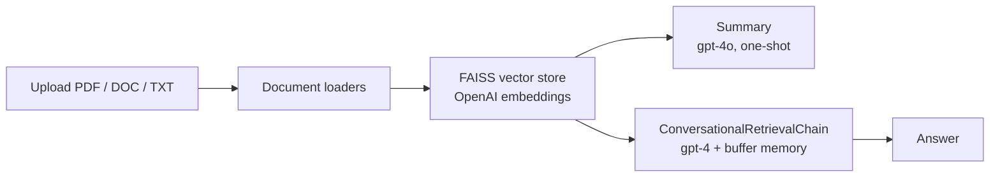

# Conversational RAG Assistant

A single-file Streamlit app for conversational Q&A over uploaded documents (PDF, DOC/DOCX, TXT) using a FAISS vector store and OpenAI models.

Upload one or more files; the app extracts their text, builds an in-memory FAISS index from OpenAI embeddings, produces a structured summary of the whole corpus, and then answers follow-up questions through a retrieval-augmented conversational chain with chat memory. It is a minimal, self-contained reference implementation — one Python file, no database, no server beyond Streamlit.

## Architecture at a glance

- **Orchestration pattern:** sequential single-chain pipeline (no agents, no routing). Four fixed stages run in order on every upload: load → embed → summarize → chat.
- **Models:** `gpt-4o` for the one-shot corpus summary (direct OpenAI SDK call), `gpt-4` inside the conversational chain (via LangChain `ChatOpenAI`, temperature 0).
- **Framework:** LangChain (`ConversationalRetrievalChain`) on Streamlit.
- **Memory / session state:** `ConversationBufferMemory` holds the full chat history in process memory; nothing is persisted between Streamlit reruns or sessions.
- **Retrieval:** FAISS (in-memory) over `OpenAIEmbeddings`, default retriever settings.



Deeper documentation: [docs/ARCHITECTURE.md](docs/ARCHITECTURE.md) · [docs/EVALUATION.md](docs/EVALUATION.md) · [docs/HARDENING.md](docs/HARDENING.md)

## Quickstart

```bash
git clone https://github.com/git-bonda108/conversational-rag-assistant.git
cd conversational-rag-assistant
python -m venv .venv && source .venv/bin/activate
pip install -r requirements.txt
echo "OPENAI_API_KEY=sk-..." > .env
streamlit run rag-doc.py
```

Expected output:

```
  You can now view your Streamlit app in your browser.

  Local URL: http://localhost:8501
```

Open the URL, upload a file, and the app walks through its four labeled steps (Loading Files → Creating Vectorstore → Generating Summary → Conversational Chat).

Note: `requirements.txt` is unpinned and includes packages beyond what `rag-doc.py` imports (pandasai, pinecone, whisper, langgraph, and others). The app itself needs only the OpenAI, LangChain, FAISS, Streamlit, pypdf, unstructured, and python-dotenv portions. See [docs/HARDENING.md](docs/HARDENING.md).

## Configuration

| Variable | Required | What it is | Where to get it |
|---|---|---|---|
| `OPENAI_API_KEY` | Yes | OpenAI API key used for embeddings, summary, and chat. Loaded from `.env` via python-dotenv; the app raises at startup if unset. | https://platform.openai.com/api-keys |

No other configuration exists. Never commit the `.env` file.

## Status

Minimal reference implementation. No automated tests and no deployment tooling are included; [docs/EVALUATION.md](docs/EVALUATION.md) and [docs/HARDENING.md](docs/HARDENING.md) state the current posture honestly and propose the path forward.
